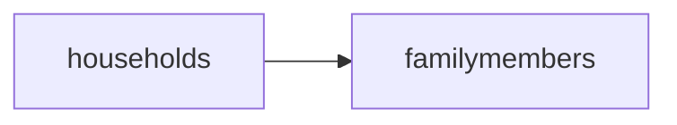

# Government Grant

# Npm library installation and startup
npm install express --save  
npm install mongoose --save  
npm install body-parser --save  
npm install uuid --save  
npm install -g nodemon  
**Startup**  
node index **OR** nodemon index   
# Schema design
This database is designed in tree structure so as to achieve search complexity of O(log n). **households** is the Parent. **familymembers** is the children

# API call
**1) Create household** 
Added extra field : address and income. Used UUID as unique identifier. If address exists household cannot be created. 
Tested using postman (Post) : http://localhost:8080/api/households (body -> x-www-form-urlencoded)  
address:"ADDRESS" 
housingType:HDB 
*Note : enum: ['Landed', 'HDB', 'Condominium'] 
 
**2) Add a family member to an household** 
Added extra field : _id and address. Used address to link back to household (not using UUID as it will not make sense to user). If member already exists or household did not exists, it cannot be added.  
Tested using postman (Post) : http://localhost:8080/api/familyMembers (body -> x-www-form-urlencoded)  
_id:S123456G 
name:Peter Chan Zhi Wen  
gender:Male  
maritalStatus:Married  
spouse:Mary Chan Wan 
occupationType:Employed 
annualIncome:200000.0 
dob:1978-12-12 
address:123zxc 
*Note : enum: ['Male', 'Female'] 
*Note : enum: ['Married', 'Single', 'Divorced'] 
*Note : enum: ['Employed', 'Unemployed', 'Student', 'Others'] 
 
**3) List households** 
Listed all household and return household data followed by array of family members in that household.  
Tested using postman (Get) : http://localhost:8080/api/households  
 
**4) Show household** 
Show household by entering the address of the household.  
Tested using postman (Get) : http://localhost:8080/api/household?address=ADDRESS  
 
**5) Search for households and recipients of grant disbursement endpoint** 
*Note : different scheme will be determined by a switch case of scheme, income and age are variable component which allow the rule to change when needed  
**(i) List households and qualifying family members for Student Encouragement Bonus** 
Assumption : Only award to the children below 16 hence only return the student records not entire family  
Tested using postman (Get) : http://localhost:8080/api/grant?scheme=StudentEncouragementBonus&age=16&income=150000  
**(ii) List households and qualifying family members for Family Togetherness Scheme** 
Assumption : Only the couple is awarded the grant  
Tested using postman (Get) : http://localhost:8080/api/grant?scheme=FamilyTogethernessScheme&age=18&income=0  
Income field is ignored in this case.  
**(iii) List households and qualifying family members for Elder Bonus** 
Assumption : Only the eldery staying in HDB is awarded the grant not the other family members  
Tested using postman (Get) : http://localhost:8080/api/grant?scheme=ElderBonus&age=50&income=0  
Income field is ignored in this case.  
**(iv) List households and qualifying family members for Baby Sunshine Grant** 
Assumption : Only the baby is awarded the grant not the other family members  
Tested using postman (Get) : http://localhost:8080/api/grant?scheme=BabySunshineGrant&age=5&income=0  
Income field is ignored in this case.  
**(v) List households that qualify for the YOLO GST Grant** 
Assumption : Display only the HDB household data as only one grant per household  
Tested using postman (Get) : http://localhost:8080/api/grant?scheme=YOLOGSTGrant&age=0&income=100000  
Age field is ignored in this case.  
# Optional End-Points (for bonus points)
**1) Delete household (Remove Household and family members)** 
Tested using postman (Delete) : http://localhost:8080/api/household?address=ADDRESS  
**1) Delete Family Member** 
Tested using postman (Delete) : http://localhost:8080/api/familyMember?id=NRIC  
# Set up mongodb
**Install Mongodb** 
Can install via executable msi file or zip file then extract to your directory. Note the environment variable is not auto added. 
https://fastdl.mongodb.org/win32/mongodb-win32-x86_64-2012plus-4.2.12-signed.msi  
https://fastdl.mongodb.org/win32/mongodb-win32-x86_64-2012plus-4.2.12.zip  
You may download the database viewer below to view the data added  
https://studio3t.com/download/  
**Mongodb Startup script** 
In the github repository script folder.  
https://github.com/MichaelAng86/govtgrantnodejs/tree/master/script  
**Mongodb Create database - govtgrant** 
Note : upon started mongodb, you need to create a database first by following below steps in the link
https://www.tutorialspoint.com/mongodb/mongodb_create_database.htm  
**Populating database - govtgrant** 
Mongodb collection (in SQL is called table) can be created by running the code. Below script will help you to populate both collection and data for the application to query.  
In the github repository script folder.   
https://github.com/MichaelAng86/govtgrantnodejs/tree/master/script  
